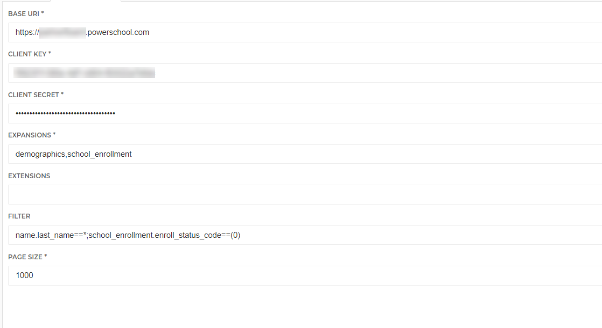

# HelloID-Conn-Prov-Source-PowerSchool-SIS-Students

| :information_source: Information |
|:---------------------------|
| This repository contains the connector and configuration code only. The implementer is responsible to acquire the connection details such as username, password, certificate, etc. You might even need to sign a contract or agreement with the supplier before implementing this connector. Please contact the client's application manager to coordinate the connector requirements.       |

 

  

HelloID Provisioning Source Connector for PowerSchool SIS

<!-- TABLE OF CONTENTS -->
## Table of Contents
* [Getting Started](#getting-started)
* [Setting up the API access](#setting-up-the-api-access)
* [Configuration](#configuration)

<!-- GETTING STARTED -->
## Getting Started
By using this connector you will have the ability to import powerschool data into HelloID:

* Student Demographics
* Student School Enrollments

## Setting up the API Access
- Click System Settings. The System Settings page appears.
- Click Plugin Management Configuration. The Plugin Management Dashboard page appears.
- Click Install. The Plugin Install page appears.
- For the Plugin Installation File, see  [Tools4ever_plugin.zip](Assets/Tools4ever_plugin.zip)
- Click Install. A confirmation message appears. The plugin appears in the Installed Plugins section on the Plugin Management Dashboard page.
- Retrieve Client ID and Secret

## Setup the PowerShell connector
1. Add a new 'Source System' to HelloID and make sure to import all the necessary files.

    - [ ] configuration.json
    - [ ] person.ps1
    - [ ] department.ps1

2. Fill in the required fields on the 'Configuration' tab. See also, [Setting up the API access](#setting-up-the-api-access)

* Base URI
  * URL of the PowerSchool Instance
* Client Key
* Client Secret
* Expansions
  * Using element expansion increases performance of your application by allowing requests for only subsets of the resource and not the whole resource itself. By limiting the requests to only the data that is needed, the size and bandwidth of the response, the load on the server, and how much time it takes for the request to make a round-trip are all reduced. Each resource with expandable elements will publish them in the result using the @expansions attribute. 
  
  Examples = demographics, addresses, alerts, phones, school_enrollment, ethnicity_race, contact, contact_info, initial_enrollment, schedule_setup, fees, lunch
* Extensions
  * Resource extensions (1:1) are resources that extend core resources. They can be defined by the system, the installed state package, or by user-created extensions. They are based on PowerSchool schema extensions. They behave like, and are requested like, . Each resource with extensions will publish them in the default result using the @extensions attribute. Zero to many elements can be selected. Unknown extension requests are ignored. If the resource is writable, such as Student, then the user-defined extensions to that resource are also writable.

  Examples = studentcorefields,c_studentlocator
* Filter
  * Filter the students to be returned. By default, active and pre-registered are included
* Page
  * Default size is 100. Allowed size is 100-1000

_For more information about our HelloID PowerShell connectors, please refer to our general [Documentation](https://docs.helloid.com/hc/en-us/articles/360012557600-Configure-a-custom-PowerShell-source-system) page_

# HelloID Docs
The official HelloID documentation can be found at: https://docs.helloid.com/
